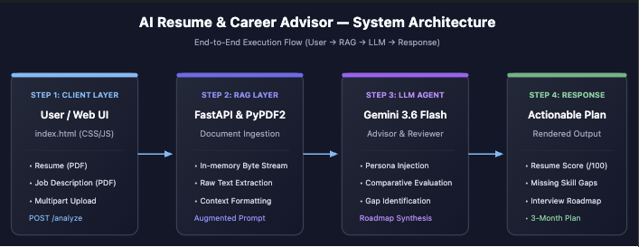

# AI Resume & Career Advisor

An intelligent, full-stack career advisory web application powered by **FastAPI** and **Google Gemini 3.6 Flash**. It extracts unstructured text from user-uploaded Resume and Job Description PDFs, performs skill gap analysis, computes an alignment score, and generates an interview roadmap alongside a tailored 3-month preparation plan.

---

## System Architecture



### Execution Pipeline:
1. **Client Layer (UI):** Responsive, animated web frontend (`index.html`) handles dual PDF file selection and asynchronous multipart POST requests.
2. **RAG & Extraction Layer:** FastAPI backend parses the in-memory byte streams using `PyPDF2` to extract clean plain text without writing sensitive documents to disk.
3. **LLM Agent Core:** Grounded system prompt injects extracted resume and job description text into `gemini-3.6-flash`, functioning as an expert corporate career reviewer.
4. **Actionable Response:** Structured output delivering a match score (out of 100), explicit skill gaps, targeted interview prep topics, and a 3-month week-by-week learning roadmap.

---

## Tech Stack
- **Backend:** Python 3, FastAPI, Uvicorn
- **LLM / AI:** Google GenAI SDK (`gemini-3.6-flash`)
- **Document Parsing:** PyPDF2
- **Frontend:** HTML5, Modern CSS (Glassmorphism & animations), JavaScript (Fetch API)
- **Configuration & Security:** `python-dotenv` for API key encapsulation

---

## Local Setup & Installation

1. **Clone repository:**
   ```bash
   git clone [https://github.com/parvgoyel6/AI-Career-Advisor.git](https://github.com/parvgoyel6/AI-Career-Advisor.git)
   cd AI-Career-Advisor


📄 **[Download Project Report (PDF)](Project_Report.pdf)**
